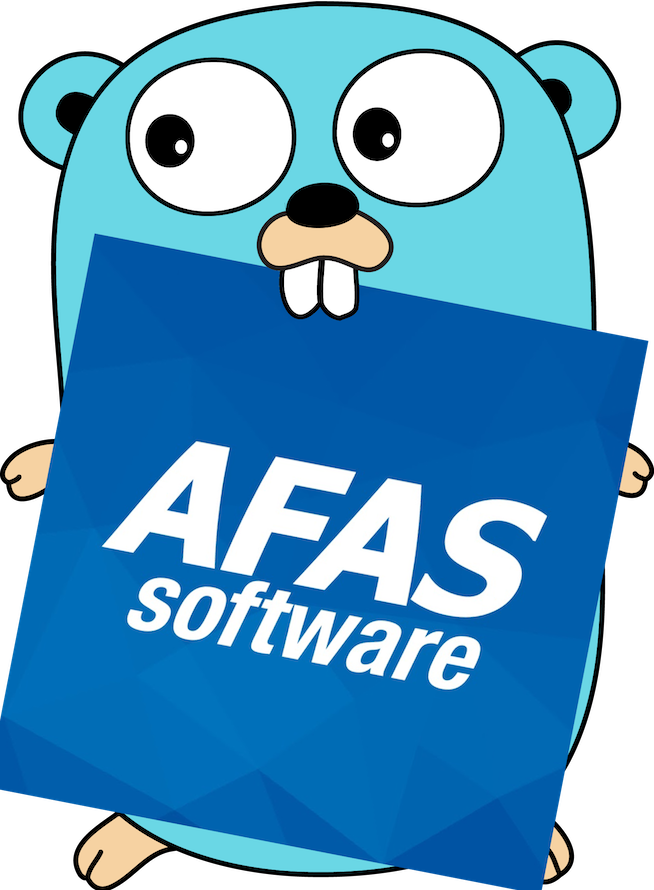

<p align="center">
    
</p>

<br>

<h1 align="center">
    Go-Afas-AppConnector-Cli
</h1>

<br>

This is a simple CLI tool that will gererate all the struct types for the GetConnectors and the UpdateConnectors that you have added to your AppConnector in AFAS Profit. It uses the [Meta Data API](https://help.afas.nl/help/NL/SE/App_Cnr_Rest_GET.htm#o85222) to build the struct type.

. **[Features](#features)** . **[Install](#install)** . **[Sample commands](#sample-commands)** . **[Sample struct](#sample-struct)** .

---

## Features

- Create structs from [GetConnectors](https://help.afas.nl/help/NL/SE/App_Cnr_Rest_GET.htm?query=getconnec) and [UpdateConnectors](https://help.afas.nl/help/NL/SE/App_Conect_UpdDsc.htm?)
- Run manually.
- Save apps (AppConnectors) to a config file inside [os.UserConfigDir()](https://pkg.go.dev/os#UserConfigDir) for easy updating the stuct types.
- Saves tokens AES encrypted to the config file.
- Comments about length, mandatory, decimal points etc...
- Import statement time.Time for date fields.
- Formatting the .go file.
- No third party modules are used.

---

## Install

```bash
# Creates a randome(1) 32 bit string that is used as CipherKey in the EAS encryption. This encryptes the AFAS token.
$ rand=$(openssl rand -hex 16)

# [optional] Overrule the default config location os.UserConfigDir() (2)
$ configpath="/Users/Remco/.config/"

# building the cli
$ go install github.com/RemcoE33/go-afas-appconnector-cli  \
    -o "go-afas" \
    -ldflags="-X 'lib.CipherKey=$rand'" \
    -ldflags="-X 'main.ConfigPath=$configpath'"

# clear the shell variables
$ unset rand
$ unset configpath
```

1. [openssl rand](https://www.openssl.org/docs/man1.0.2/man1/openssl-rand.html)
2. [os.UserConfigDir()](https://pkg.go.dev/os#UserConfigDir)

---

## Sample commands

### Add:

Adding a new AppConnector to the config file.

```bash
# long flags:
$ go-afas add \
    -test \
    -member "11111" \
    -token "<token><version>1</version><data>xxx</data></token>" \
    # optional, otherwise the current directory is set as output location
    -location "/Users/Remco/Downloads/test"

# shorthanded flags:
$ go-afas add \
    # environment test
    -et \
    -m "11111" \
    -t "<token><version>1</version><data>xxx</data></token>" \
    # optional, otherwise the current directory is set as output location
    -l "/Users/Remco/Downloads/test"
```

### List:

List added AppConnectors from the config file

```bash
$ go-afas list

  # |   Member |   Environment type |      Description | Location
  1 |    11111 |         production |   MyAppConnector | /Users/Remco/repos/MyGoApp
```

### Run:

Run # from the list above

```bash
# long flags:
$ go-afas run -number 1

# shorthanded flags:
$ go-afas run -n 1
```

### Manually:

Run the generation without saving to the config file first:

Same as `add` but use `man`

### Delete:

```bash
# long flags:
$ go-afas del -number 1

# shorthanded flags:
$ go-afas del -n 1
```

---

## Sample struct

```go
package appconnector

// This code is generated with go-afas-appconnector
// DO NOT EDIT BY HAND

// Description: Verlofsaldo
// Endpoint: HrAbsBalance
type RootHrAbsBalance struct {
	HrAbsBalance struct {
		Element struct {
			Fields struct {
				Medewerker              string  `json:"EmId"` // Length: 15		Not-zero: true		 Mandatory: true
				Werkgever               string  `json:"ErId"` // Length: 15		Not-zero: true		 Mandatory: true
				Dienstverband           int     `json:"EnSe"` // Length: 9		Not-zero: false		 Mandatory: true
				TypeVerlof              string  `json:"ViAt"` // Length: 10		Not-zero: true		 Mandatory: true
				Verlofperiodetabel      int     `json:"PtId"` // Length: 5		Not-zero: true		 Mandatory: true
				Boekjaar                int     `json:"Year"` // Length: 4		Not-zero: true		 Mandatory: true
				Verlofperiode           int     `json:"SeNo"` // Length: 3		Not-zero: true		 Mandatory: true
				ActueelSaldo            float64 `json:"AcSa"` // Length: 8		Not-zero: false		 Mandatory: false	 Decimals: 2
				ActueelSaldoUrenMinuten float64 `json:"AcSh"` // Length: 8		Not-zero: false		 Mandatory: false	 Decimals: 2
			} `json:"Fields"`
		} `json:"Element"`
	} `json:"HrAbsBalance"`
}
```
